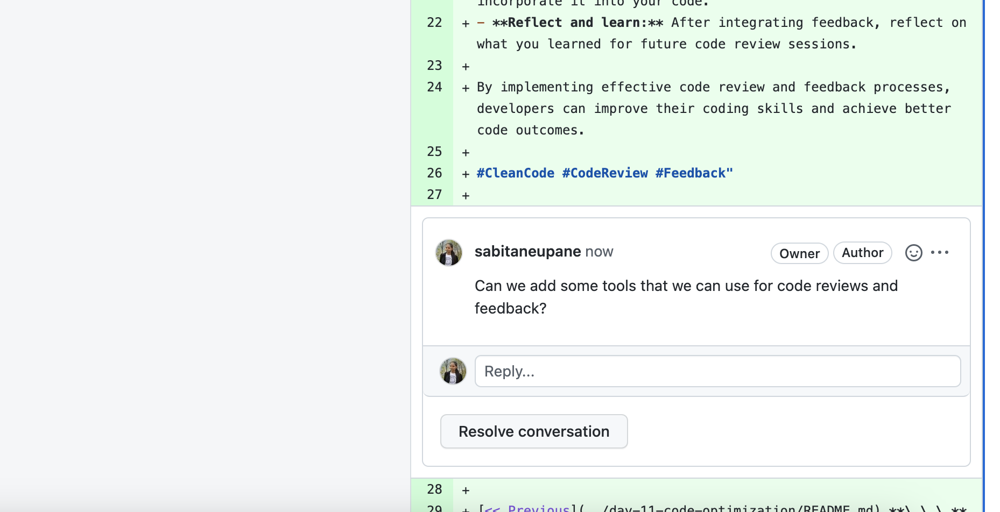

# Clean Code: Code Review and Feedback

[<< Go Back](../README.md)

## Code Review and Feedback: Receiving and Incorporating Feedback on Your Code

> Feedback is key to growth, especially in code development. Learn how to receive and integrate feedback eedback on your code for better outcomes.

Code review is an important aspect of software development, allowing teams to identify and fix coding problems early on. It also provides developers with an opportunity to receive feedback on their coding techniques, helping them to grow and improve. To maximize the benefits of code review, it's crucial to have an effective process in place and to approach feedback in a constructive and positive manner.

### Tips and technique for Code Review and Feedback:

- **Preparation:** Thoroughly review the code before giving or incorporating feedback.
- **Be specific:** Offer clear, specific, and actionable feedback.
- **Good communication:** Maintain open communication with the reviewer or code author.
- **Empathy:** Consider the perspective of the code author or reviewer.
- **Focus on code:** Limit feedback to the code and how it can be improved.
- **Provide solutions:** Offer suggestions for improvement when providing feedback.
- **Proactive:** Address potential issues or problems in the code.
- **Take breaks:** If needed, take a break to regain perspective.
- **Integrate feedback:** Carefully consider feedback and incorporate it into your code.
- **Reflect and learn:** After integrating feedback, reflect on what you learned for future code review sessions.

By implementing effective code review and feedback processes, developers can improve their coding skills and achieve better code outcomes.

## Tools

- **Version Control:** Such `Github` as it offers built-in code review functionality, making it easy to request feedback from others and manage review comments.

---

#CleanCode #CodeReview #Feedback #CodeFeedback #CodeQuality #SoftwareEngineering #ProgrammingBestPractices #CodeMentorship #CodeCollaboration #CodeImprovement #CodeEfficiency #CodeRefactoring

---

[<< Previous](../day-11-code-optimization/README.md) **\_\_\_**
[Next >>](../day-13-code-documentation/README.md)
